# Tracktory

> AI 기반 자율전공 학습경로 추천 시스템

Tracktory는 관심사와 경험은 있지만 아직 진로와 전공 선택이 명확하지 않은 학생을 위해, **직무 탐색 → 트랙 조합 추천 → 학기별 수강 로드맵**으로 이어지는 개인화 학습경로를 제안하는 모바일 서비스입니다.

한성대학교 트랙제와 교과목 구조를 기반으로 사용자의 온보딩 정보, 이수 과목, 관심 분야를 분석하고, AI 추천 파이프라인을 통해 다음 학습 선택을 설명 가능한 형태로 제공합니다.

## What We Build

| 영역 | 설명 |
|---|---|
| 직무 탐색 | 관심사, 개발 분야, 근무 가치관, 경험 정보를 바탕으로 적합한 직무 후보를 찾습니다. |
| 트랙 추천 | 직무와 교과목 연결성을 바탕으로 주 추천 트랙과 보조 트랙 조합을 제안합니다. |
| 수강 로드맵 | 추천 트랙과 이수 현황을 반영해 학기별 과목 흐름과 선수 과목 관계를 정리합니다. |
| 역량 리포트 | 추천 직무 기준 현재 역량, 부족 영역, 다음 액션을 분석 리포트로 제공합니다. |
| AI 챗봇 | 사용자의 프로필과 추천 맥락을 바탕으로 전공·직무·과목 선택 질문에 답합니다. |

## Architecture

Tracktory는 앱이 Spring Boot 백엔드와만 통신하고, AI 연산은 내부 FastAPI 중계 서버가 담당하는 구조를 사용합니다. Spring Boot는 인증, 프로필, 이수 과목, 추천 결과 영속화와 앱-facing API를 담당하며, FastAPI/LangGraph 서비스는 직무 매칭, 트랙 시너지 계산, 로드맵 생성, 자연어 설명 생성을 담당합니다.

## Diagrams

### 1. 전체 시스템 아키텍처

### 2. 온라인 추천 파이프라인

### 3. 챗봇 파이프라인

### 4. 오프라인 인덱싱 파이프라인

### 5. 시너지 점수 공식

### 6. 슬롯 예약

### 7. 4-tier 다양성 트리

### 8. 역추적 로드맵

### 9. 역량 커버리지

## Repositories

| Repository | Role | Stack |
|---|---|---|
| [Tracktory/Frontend](https://github.com/Tracktory/Frontend) | 모바일 앱 클라이언트. 인증, 온보딩, 추천 결과, 분석 리포트, 챗봇, 마이페이지 화면을 제공합니다. | Expo · React Native · TypeScript · React Navigation · Zustand |
| [Tracktory/Backend](https://github.com/Tracktory/Backend) | 앱-facing 메인 백엔드. 인증, 사용자 프로필, 이수 과목, 카탈로그, 추천 결과 저장과 AI 중계 호출을 담당합니다. | Java 21 · Spring Boot · JPA · MySQL · Spring Security |
| [Tracktory/tracktory-ai](https://github.com/Tracktory/tracktory-ai) | AI 추천 중계 서버. LangGraph 기반 추천 그래프, RAGFlow 검색, 챗봇, 직무 브리핑 API를 담당합니다. | Python 3.13 · FastAPI · LangGraph · Pydantic · RAGFlow |

## Tech Focus

- **Mobile UX**: Expo 기반 네이티브 앱, 온보딩 중심 입력 흐름, 추천 결과 탐색 UI, 챗봇 오버레이
- **Backend Boundary**: JWT 인증, API 응답 envelope, 추천 결과 캐싱/영속화, AI relay 내부 인증
- **AI Workflow**: LangGraph state-first 추천 그래프, Pydantic 구조화 출력, RAGFlow 기반 직무·과목 검색
- **Academic Data Modeling**: 한성대 단과대, 학부, 트랙, 과목, 직무, 기술스택, 선수과목 관계 모델링
- **Quality Gate**: Ruff/mypy/pytest, Gradle Spotless/Checkstyle/JUnit, Expo lint 기반 레포별 검증 루틴

## Team

| Member | Focus |
|---|---|
| [@jwon0523](https://github.com/jwon0523) | Project lead, recommendation system, LangGraph pipeline, Spring Boot and FastAPI integration |
| [@ThreeeJ](https://github.com/ThreeeJ) | Chatbot agent, track synergy, job-competency mapping |
| [@parkseonghun598](https://github.com/parkseonghun598) | Data processing, React Native frontend |
| [@J2H3233](https://github.com/J2H3233) | Research, embedding/RAG optimization, Spring Boot |

## Project Status

Tracktory is developed as a Hansung University capstone project. The codebase is split into independent repositories so each layer can evolve with clear ownership while sharing one product contract.
